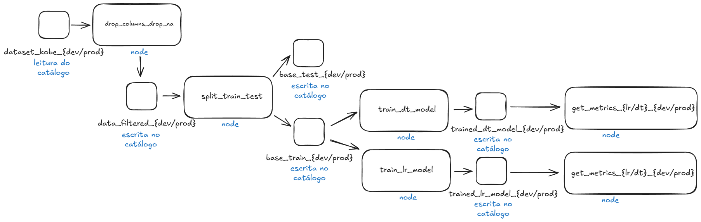

# 25e1-3-eng-ml-kobe-alan-echer

***

##### Trabalho Engenharia de Machine Learning - Alan Echer [(Link do Github)](https://github.com/echer/25e1-3-eng-ml-kobe-alan-echer.git)

***

1. Este projeto tem o objetivo de apresentar os elementos aprendidos na aula de engenharia de machine learning, através da criação de uma solução capaz de analisar um conjunto de dados de arremesso do jogador de basquete kobe bryant, e assim treinar um modelo capaz de prever com uma determinada precisão se o arremesso que será realizado pelo kobe acertará ou não a cesta. Iremos utilizar a metodologia do framwork TDSP através da estrutura do kedro.

***

2. Os datasets de dev e prod foram armazenados seguindo a seguinte estrutura: 

Segue abaixo o diagrama demostrando todas as etapas do projeto. 

https://excalidraw.com/#room=cd3f01d539bfa6994444,bzKX0k0Hkq-9AGS60N83-Q

***

3. O MLFlow ajuda nos pontos de rastreamento do experimento através da interface gráfica, deixando registrado todos os detalhes do treinamento e do modelo, ele também permite que o modelo seja servido para consumo em formato de API, permitindo também que seja consultado sua saude. O framework PyCaret e o scikit-learn permite o treino, tuning e atualização do nosso modelo baseado nos algoritmos que definimos em nossa pipeline.

***

4. Segue abaixo os artefatos criados e seu detalhe:
    1. Artefato 1 (dataset_kobe{dev/prod}.parquet) - Dataset original dev e prod guardadas na pasta data/01_raw/, o dataset contém os registros dos arremessos do kobe bryant e um indicador para saber se acertou ou não.
    2. Artefato 2 (data_filtered.parquet) - Dataset com dados filtrados, foram removidos dados nulos e algumas colunas dexando apenas as colunas a seguir: 
        1. lat - Latitude do jogador kobe
        2. lon - Longitude do jogador kobe
        3. minutes_remaining - Minutos restantes para o término da partida
        4. period - Periodo ou tempo da partida atual
        5. playoffs - Jogos de eliminatória
        6. shot_distance - Distancia do arremesso
        7. shot_made_flag - Indicador se fez acertou ou não o arremesso
    3. Artefato 3 (base_train) - Dataset contendo 80% dos dados do dataset 'data_filtered' estratificando os dados baseado na coluna target shot_made_flag, o dataset segue a mesma estrutura do artefato 2.
    4. Artefato 4 (base_test) - Dataset contendo 20% dos dados do dataset 'data_filtered' estratificando os dados baseado na coluna target shot_made_flag, o dataset segue a mesma estrutura do artefato 2. **

***

5. Foi implementado o Pipeline 'PreparacaoDados' que utiliza os datasets da pasta raw (dataset_kobe_dev.parquet/dataset_kobe_prod.parquet), as linhas que continham dados faltantes foram removidos da base, foram removidos também algumas colunas deixando apenas as colunas seguintes na base: lat, lon, minutes_remaining, period, playoffs, shot_distance, shot_made_flag. Após o processamento dos dados o novo dataset foi salvo na pasta /05_model_input/base_train.parquet (80% da base), pois irá servir para treinar o modelo. Foram separados também 20% da base original antes do treino do modelo para servir como teste, são dados que nunca foram utilizados nem para escolher o melhor modelo para não criar nenhum tipo de viés, além das estratégias de 10 validações cruzadas realizadas para evitar esse tipo de comportamento.

***Registre os parâmetros (% teste) e métricas (tamanho de cada base) no MlFlow***

***

6. Foi implementado o pipeline 'Treinamento' para treinar o modelo utilizado os dados de treino, foram treinados dois modelos através do PyCaret, o primeiro modelo foi um modelo de regressão logistica (lr) do sklearn, o segundo modelo foi um modelo de arvore de decisão (dt) do sklearn. Os modelos foram treinados com 100 iteracoes e utilizando a metrica F1 score para o tuning. 

***Registre a função custo "log loss" usando a base de teste***
***Registre a função custo "log loss" e F1_score para o modelo de árvore.***
***Selecione um dos dois modelos para finalização e justifique sua escolha.***

7.

8.


Comando para rodar o mlflow na pasta: mlflow ui --backend-store-uri ./mlflow_runs/

Comando para executar o mflow web: mlflow ui --backend-store-uri ./mlflow_runs

Comando para servir o modelo: MLFLOW_TRACKING_URI=file://$PWD/mlflow_runs mlflow models serve -m models:/trained_best_model/latest --env-manager=local --port 5001


O aluno categorizou corretamente os dados?	

OK - O aluno integrou a leitura dos dados corretamente à sua solução?

O aluno aplicou o modelo em produção (servindo como API ou como solução embarcada)?	

O aluno indicou se o modelo é aderente a nova base de dados?

OK - O aluno criou um repositório git com a estrutura de projeto baseado no Framework TDSP da Microsoft?

O aluno criou um diagrama que mostra todas as etapas necessárias para a criação de modelos?	

OK - O aluno treinou um modelo de regressão usando PyCaret e MLflow?

O aluno calculou o Log Loss para o modelo de regressão e registrou no mlflow?	

OK - O aluno treinou um modelo de árvore de decisao usando PyCaret e MLflow?

O aluno calculou o Log Loss e F1 Score para o modelo de árvore de decisão e registrou no mlflow?	

O aluno indicou o objetivo e descreveu detalhadamente cada artefato criado no projeto?	

O aluno cobriu todos os artefatos do diagrama proposto?	

O aluno usou o MLFlow para registrar a rodada "Preparação de Dados" com as métricas e argumentos relevantes?	

O aluno removeu os dados faltantes da base?	

O aluno selecionou as colunas indicadas para criar o modelo?	

O aluno indicou quais as dimensões para a base preprocessada?	

O aluno criou arquivos para cada fase do processamento e os armazenou nas pastas indicadas?	

OK - O aluno separou em duas bases, uma para treino e outra para teste

OK - O aluno criou um pipeline chamado "Treinamento" no MlFlow?

O aluno identificou a diferença entre a base de desenvolvimento e produção?	

O aluno descreveu como monitorar a saúde do modelo no cenário com e sem a disponibilidade da variável alvo?	

O aluno implementou um dashboard de monitoramento da operação usando Streamlit?	

O aluno descreveu as estratégias reativa e preditiva de retreinamento para o modelo em operação?	

[](https://kedro.org)

## Overview

This is your new Kedro project, which was generated using `kedro 0.19.12`.

Take a look at the [Kedro documentation](https://docs.kedro.org) to get started.

## Rules and guidelines

In order to get the best out of the template:

* Don't remove any lines from the `.gitignore` file we provide
* Make sure your results can be reproduced by following a data engineering convention
* Don't commit data to your repository
* Don't commit any credentials or your local configuration to your repository. Keep all your credentials and local configuration in `conf/local/`

## How to install dependencies

Declare any dependencies in `requirements.txt` for `pip` installation.

To install them, run:

```
pip install -r requirements.txt
```

## How to run your Kedro pipeline

You can run your Kedro project with:

```
kedro run
```

## How to test your Kedro project

Have a look at the file `src/tests/test_run.py` for instructions on how to write your tests. You can run your tests as follows:

```
pytest
```

You can configure the coverage threshold in your project's `pyproject.toml` file under the `[tool.coverage.report]` section.


## Project dependencies

To see and update the dependency requirements for your project use `requirements.txt`. You can install the project requirements with `pip install -r requirements.txt`.

[Further information about project dependencies](https://docs.kedro.org/en/stable/kedro_project_setup/dependencies.html#project-specific-dependencies)

## How to work with Kedro and notebooks

> Note: Using `kedro jupyter` or `kedro ipython` to run your notebook provides these variables in scope: `context`, 'session', `catalog`, and `pipelines`.
>
> Jupyter, JupyterLab, and IPython are already included in the project requirements by default, so once you have run `pip install -r requirements.txt` you will not need to take any extra steps before you use them.

### Jupyter
To use Jupyter notebooks in your Kedro project, you need to install Jupyter:

```
pip install jupyter
```

After installing Jupyter, you can start a local notebook server:

```
kedro jupyter notebook
```

### JupyterLab
To use JupyterLab, you need to install it:

```
pip install jupyterlab
```

You can also start JupyterLab:

```
kedro jupyter lab
```

### IPython
And if you want to run an IPython session:

```
kedro ipython
```

### How to ignore notebook output cells in `git`
To automatically strip out all output cell contents before committing to `git`, you can use tools like [`nbstripout`](https://github.com/kynan/nbstripout). For example, you can add a hook in `.git/config` with `nbstripout --install`. This will run `nbstripout` before anything is committed to `git`.

> *Note:* Your output cells will be retained locally.

## Package your Kedro project

[Further information about building project documentation and packaging your project](https://docs.kedro.org/en/stable/tutorial/package_a_project.html)